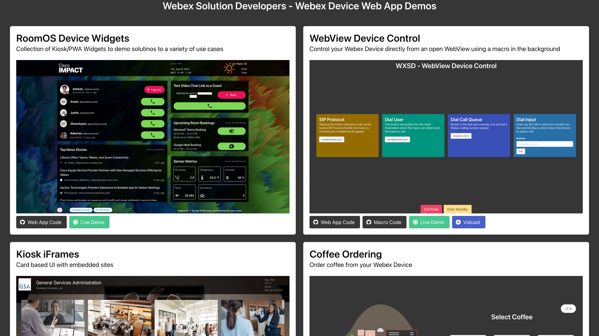

# Webex Device Web App Demos

This project contains a collection of Single-page application (SPA) demos designed to showcase solutions to many different use cases on Webex Devices.



## Overview

Cisco Webex Devices have a built in web browser which can be used to launch web apps to solve use cases and enhance experiences on the devices.

* Web Apps: A single button on the OSD of a Desk or Board series which can open a fullscreen web app
* Kiosk Mode: A persistently displayed fullscreen web app on the OSD of a Desk or Board series device which allows calling via a SIP protocol handler
* Persistent Web App (PWA): Similar to kiosk mode but for the Webex Room Navigator. This is a mode which your Navigator can be paired to a Room system with where it can permentantly display a web app
* WebViews: These are programmatically opened web apps which can be displays in Fullscreen or Modal form on either the OSD of a device or a Webex Room Navigator. If opened on a the OSD of a Room Series device, the WebView will be non-interactive.


## Setup

### Prerequisites & Dependencies: 

- Node >18.15.0 (recommended)
- Webex Device with WebEngine support to view these demos


### Installation Steps:


## Building

Open a new terminal window and follow the instructions below to setup the project locally for development/demo.

1. Clone this repository and change directory:
    ```
    git clone https://github.com/wxsd-sales/kiosk-demos && cd kiosk-demos
    ```


2. Install dependencies:
    ```bash
    npm install
    ```

3. Build project:
    ```bash
    npm run build
    ```

4. You can preview the production build and view it in your browser with this command:
    ```bash
    npm run preview -- --open
    ```


## Demo

Check out our live demo, available [here](https://wxsd-sales.github.io/kiosk-demos)!

<!-- Keep the following statement -->
*For more demos & PoCs like this, check out our [Webex Labs site](https://collabtoolbox.cisco.com/webex-labs).


## License

All contents are licensed under the MIT license. Please see [license](LICENSE) for details.

## Disclaimer

 Everything included is for demo and Proof of Concept purposes only. Use of the site is solely at your own risk. This site may contain links to third party content, which we do not warrant, endorse, or assume liability for. These demos are for Cisco Webex use cases, but are not Official Cisco Webex Branded demos.


## Questions
Please contact the WXSD team at [wxsd@external.cisco.com](mailto:wxsd@external.cisco.com?subject=kiosk-demos) for questions. Or, if you're a Cisco internal employee, reach out to us on the Webex App via our bot (globalexpert@webex.bot). In the "Engagement Type" field, choose the "API/SDK Proof of Concept Integration Development" option to make sure you reach our team. 